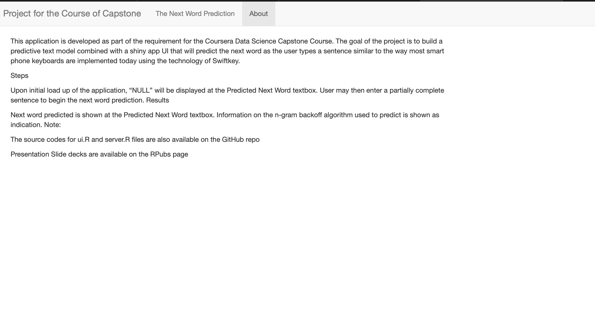
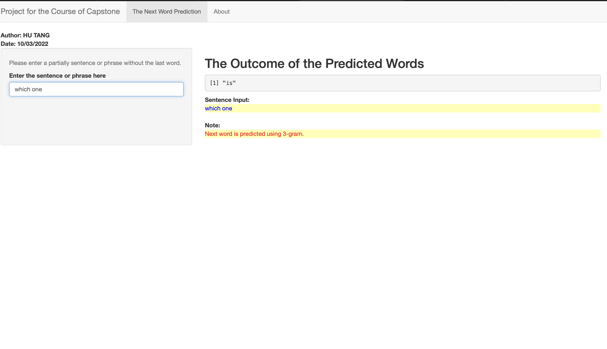

## Introductions

    1. The slide is made for the fianl project of the course of Capstone 
    for the data science specialization.

    2.The app that the slide is intrducing has built a predictive modle-forcasting words 
    by some algorithm, which is able to predicate the following word after 
    the users enters some phrase.  

    

    

--- .class #id 

## How to use the app?

At the left side of the app, you could find a text box where you need to fill in some phrases without the last word which you want to predict with the app; Then on the right side, the words predicted by the app will turn on, and if that is something wrong with the entered phrase, a notice will come out.

--- .class #id 

## The related model used

The model named 'Katz Backoff' is built into the app, which is a common n-gram language model used to estimate a word under the conditional probability. It is capable of estimating by going through the short history models so that the model with these most reliable information can be used to make a word prediction.

--- .class #id 

## Some related links

If you haven't tried out the app, go 
[here](https://polytherfromgithub.shinyapps.io/projectforweek7/?_ga=2.39271072.287820585.1665083422-1801894992.1665083422/) 
to try it!

Also, some important files I think you will need are in the repo below:
Github:  https://github.com/Polyther/Polyther.github.io/tree/main/directory

Thanks!

